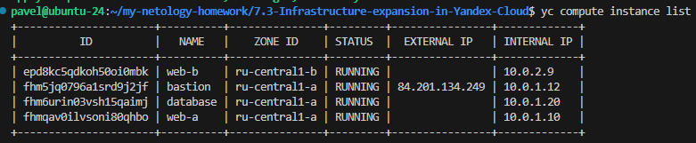
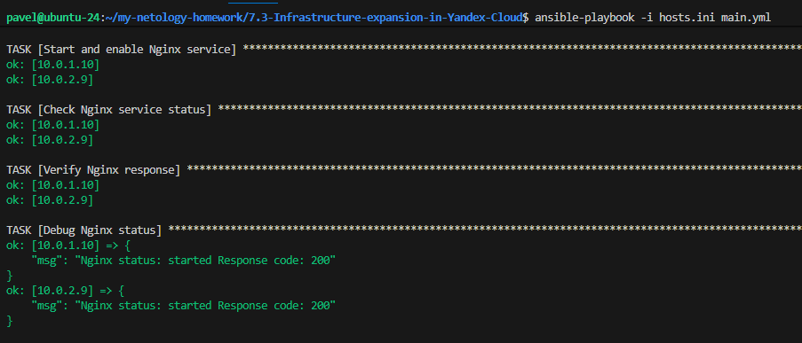
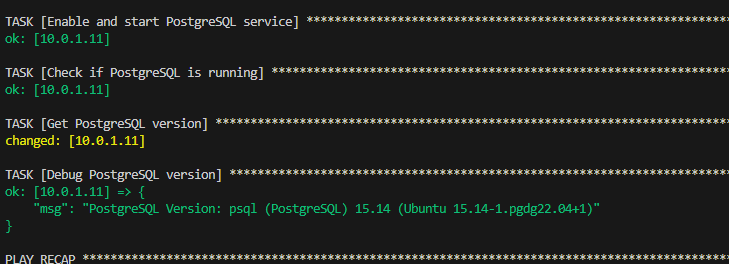

### Задание 1

Повторить демонстрацию лекции(развернуть vpc, 2 веб сервера, бастион сервер)

`

---
### Задание 2

С помощью ansible подключиться к web-a и web-b , установить на них nginx.(написать нужный ansible playbook)

`

### Задание 3

1. Добавить еще одну виртуальную машину.
2. Установить на нее любую базу данных.
3. Выполнить проверку состояния запущенных служб через Ansible.

`
